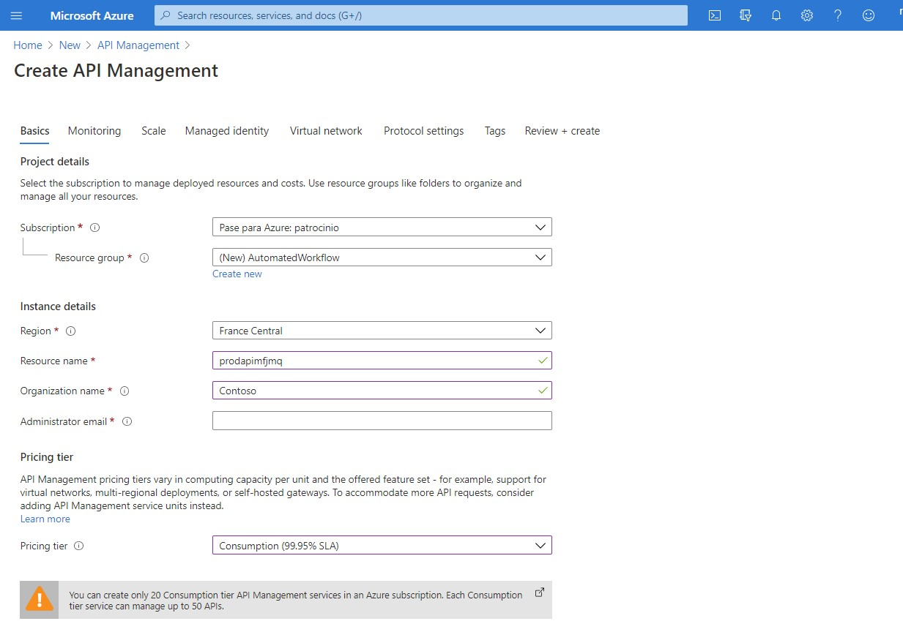
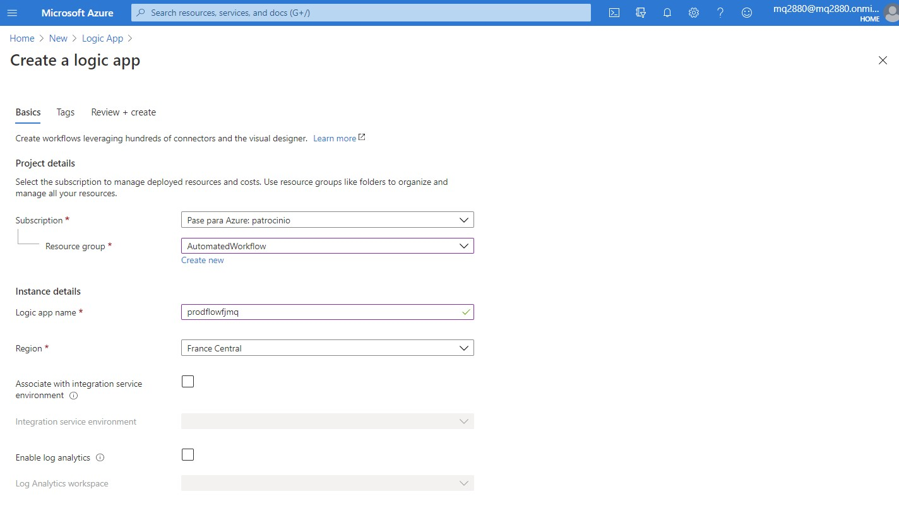
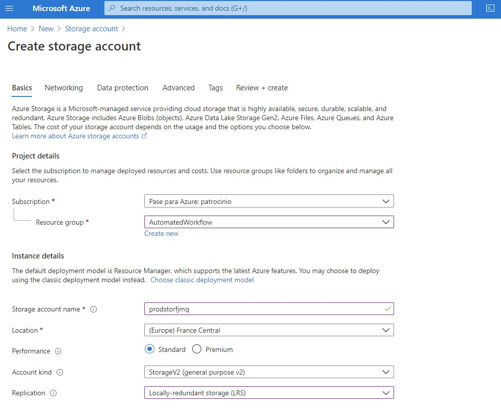
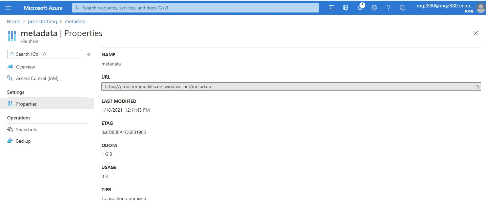
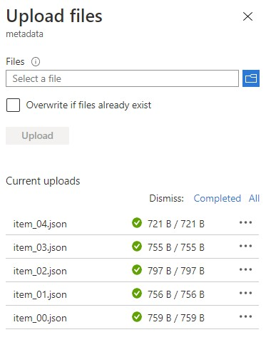
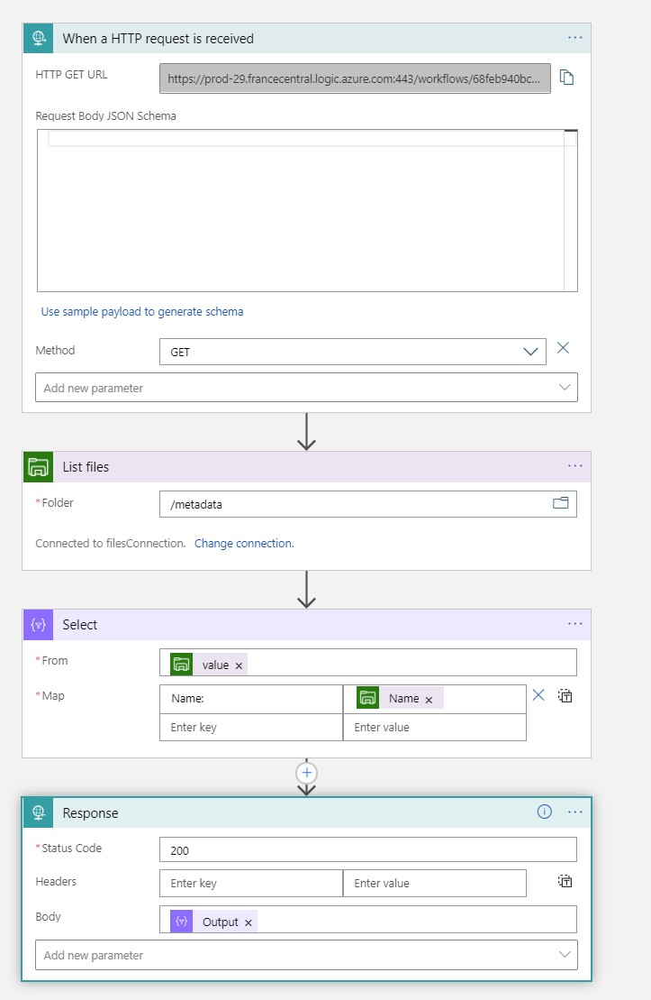
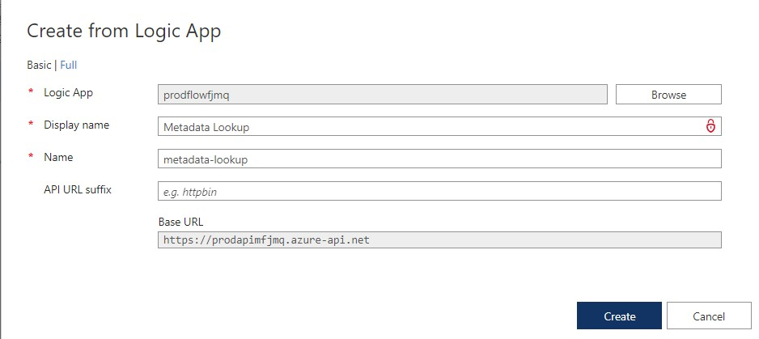
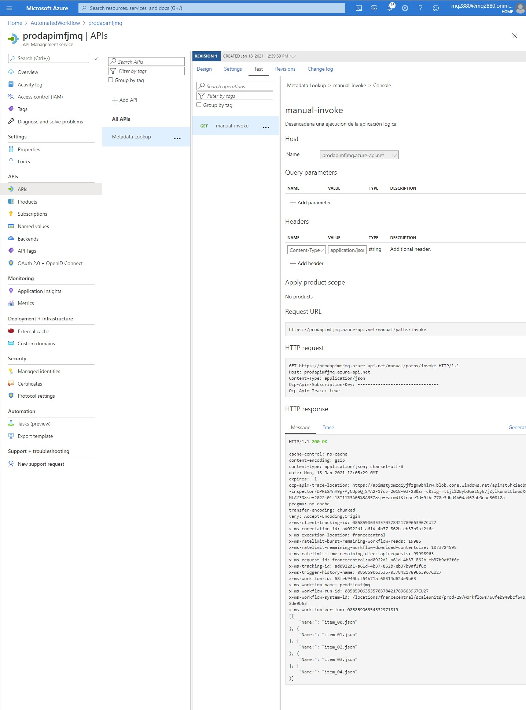

# Module 9 Develop App Service Logic Apps

## Lab: Automate business processes with Logic Apps

1. **Nombres y apellidos:** Francisco Javier Moreno Quevedo
2. **Fecha:** 17/01/2021
3. **Resumen del Ejercicio:** Crear un API del tipo Logic App y que haga una serie de acciones cuando reciva una petición HTTP
4. **Dificultad o problemas presentados y como se resolvieron:** Ninguna

### Exercise 1: Create Azure resources

Crear una nueva cuenta de API Management 

Crear un recurso de Logic App

Crear una cuenta de almacenamiento

Crear un **File Share** en la cuenta

Subir los ficheros del Lab

### Exercise 2: Implement a workflow using Logic Apps

Crear el WorkFlow del Logic App

- Triger para cuando se reciva una peticion HTTP

- Listar los ficheros del Share FIle

- Por cada fichero seleccionar el nombre

- Crear un Response con esos datos

  

  

### Exercise 3: Use Azure API Management as a proxy for Logic Apps

Dentro del API MAnagement que hemos creado, creamos un nuevo API del tipo Logic APP

Probamos

